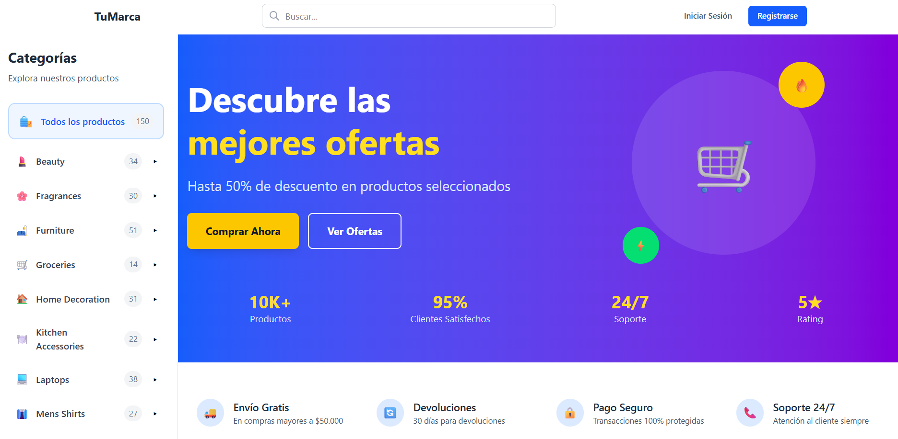
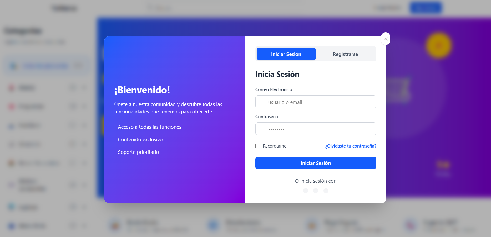
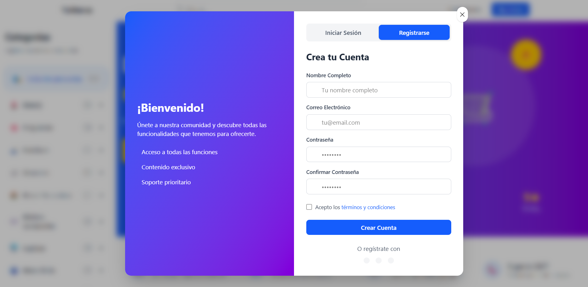
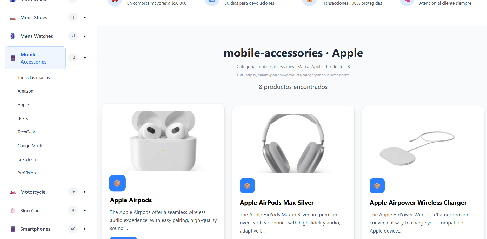

# Amazon-React 

Pequeña tienda demo construida con React + Vite y Tailwind. Utiliza la API de ejemplo https://dummyjson.com para obtener categorías y productos.

Este proyecto es una plantilla/mini-clon tipo e-commerce para practicar: 
- Listado de categorías y subcategorías (marcas) en un sidebar
- Búsqueda global de productos
- Sección de productos con tarjetas y thumbnails
- Modal de inicio/registro conectado a la app (login con dummyjson)

Arquitectura rápida:
- Vite + React (JSX)
- Tailwind CSS para estilos
- Lógica de datos: `https://dummyjson.com` (endpoints `/products`, `/products/category/:slug`, `/products/search`, `/user/login`)

## Estructura principal

- `src/App.jsx` - punto de entrada, estado principal (categoría, búsqueda, auth)
- `src/Components/Navbar.jsx` - barra superior (búsqueda, botones de auth)
- `src/Components/CategoriesAside.jsx` - sidebar de categorías y marcas (subcategorías)
- `src/Components/ProductsSection.jsx` - consulta y render de productos
- `src/Components/Card.jsx` - tarjeta de producto
- `src/Pages/InicioRegistro.jsx` - modal de login/registro (con llamada a API mock)

## Cómo ejecutar (Windows / PowerShell)

1. Instala dependencias (si no lo has hecho):

```powershell
npm install
```

2. Levanta el servidor de desarrollo:

```powershell
npm run dev
```

3. Abre la URL que Vite muestra en la consola (p. ej. `http://localhost:5175/`).

## Funcionalidades y cómo probar

- Navegación por categorías:
	- Haz clic en una categoría del sidebar. La aplicación pedirá `https://dummyjson.com/products/category/<slug>` y debería mostrar los productos con sus thumbnails.
	- Al pulsar la flecha junto a una categoría se despliegan las marcas (subcategorías) que se obtienen de los productos de esa categoría.

- Búsqueda:
	- La barra superior está enlazada a `ProductsSection` y hace consultas a `https://dummyjson.com/products/search?q=<term>`.
	- Si la búsqueda no devuelve resultados, el componente aplica un fallback que descarga una lista amplia (`/products?limit=100`) y filtra localmente por título/descripcion/brand (case-insensitive).

- Login (demo):
	- Abre "Iniciar Sesión" en la navbar.
	- Introduce credenciales y pulsa Iniciar Sesión. Se hace POST a `https://dummyjson.com/user/login` con `username`, `password` y `expiresInMins`.
	- Si es exitoso, el token y el usuario se guardan en `localStorage` y la navbar muestra el nombre de usuario y el botón "Salir".

Ejemplo de login (usuario demo):
- username: `emilys`
- password: `emilyspass`

> Nota: dummyjson es una API de prueba; los usuarios y tokens son ficticios.


## 📷 Capturas de pantalla






